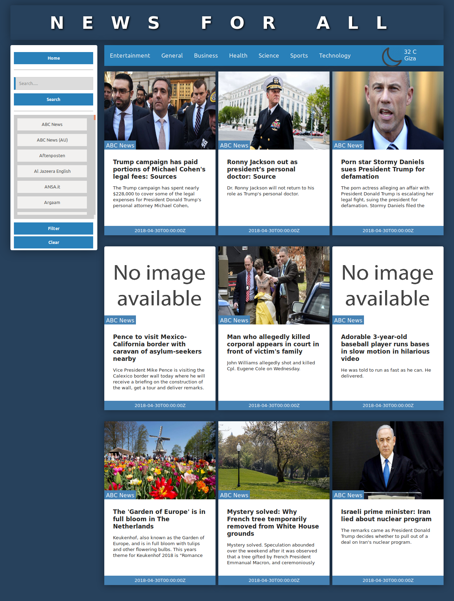
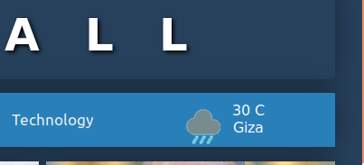

# NewsForAll

A NewForAll is a News and Weather web application (SWP)

## Features

- Provide a top headlines from.

- Provide search for a specific headline from many sources.

- Provide many international sources for the news which user
can filter the news with specific source.

- Provide weather condition for the city which user locate
currently in it.

## Used APIs

- New API check documentation [Here](https://newsapi.org/).
- Weather API check Documentation [Here](https://www.weatherbit.io/).

## Website Link

- [NewsForAll](http://newsforall.byethost9.com/)
